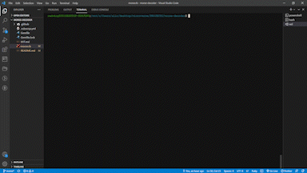

# Morse Decoder


> This algorithm using Ruby decode morse messages, its very fun you should try it ! 





Additional description about the project and its features.

## Built With

- Ruby
- Git , Git Actions, RuboCop 


## Get started

 Clone this repository to your local machine by runing these comand on your local terminal
```
git clone https://github.com/redwing555/morse-decoder.git
cd morse-decoder
git checkout dev
code . 
```


## Setup

* Change directory to the project directory `` cd morse-decoder ``
* Install the gems by runing the command line `` bundle install ``
* In the terminal run `` ruby ./morse.rb ``
* If you chose to export the outputs , you will find the csv and txt files in the project repository


## Authors

👤 **Ntazama Willy**

- GitHub: [@ntzwilly](https://github.com/ntzwilly)
- LinkedIn: [@ntazamawilly](https://linkedin.com/in/ntazama-willy-b676b7aa)

👤 **Houssam HICHAMI**

- GitHub: [@redwing555](https://github.com/redwing555)
- LinkedIn: [Houssam HICHAMI](https://linkedin.com/in/houssam-hichami)

## 🤝 Contributing

Contributions, issues, and feature requests are welcome!

Feel free to check the [issues page](../../issues/).

## Show your support

Give a ⭐️ if you like this project!

## Acknowledgments

- Hat tip to anyone whose code was used
- Inspiration
- etc

## 📝 License

This project is [MIT](./MIT.md) licensed.
